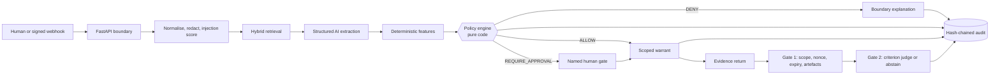

# Warrant

Warrant is a working delegation control plane for coding-agent work. It decides whether a requested delegation may proceed, requires a named human to approve it when risk warrants that, issues a scoped and expiring warrant, verifies returned evidence, and preserves the complete decision in a hash-chained audit ledger.

> **Synthetic demo:** every issue, identity, agent, and activity in this repository is fictional. The default AI provider is a visibly labelled deterministic fixture. Fixture results are not represented as live-model evaluation evidence.

> **Hard data rule:** the experimental OpenRouter free endpoint may receive synthetic
> data only. Never point it at real customer issues, code, credentials, or attachments.

## Why it exists

Issue trackers and coding agents provide delegation mechanics, OAuth scopes, and post-hoc review. They do not produce a reproducible per-work-item answer to four connected questions: should this work have been delegated, what was the agent allowed to touch, who authorised it, and did its returned evidence satisfy the request? Warrant owns that workflow-level accountability boundary without becoming another tracker or agent.

## Current MVP

- Manual delegation and signed/idempotent webhook ingress.
- 400 fictional issues across five teams, 12 users, three agents, and six governed repository surfaces.
- Hybrid SQLite FTS5 plus deterministic local-vector retrieval with reciprocal-rank fusion.
- `LLMProvider` abstraction with fixture, OpenAI, and first-class OpenRouter providers.
- Closed extraction schema with no authorisation field.
- Deterministic consequence, reversibility, surface, concurrency, injection, ownership, and evidence-sufficiency features.
- Validated executable YAML policy engine with a consequence × reversibility matrix.
- Immutable admin policy simulation/activation API with an adversarial unsafe-allow gate.
- Human approval, denial, and scope narrowing; humans cannot widen policy-proposed scope.
- Scoped four-hour warrant, policy-derived tool grants, expiry/revocation lifecycle,
  evidence contract, and single-use nonce.
- Deterministic verification gate followed by a schema-bound evidence judge that may abstain.
- Hash-chained append-only audit ledger, integrity check, CSV export, persisted product telemetry, and model-usage records.
- Provider retry/repair/optional fallback, embedding circuit breaker, extraction cache,
  team-filtered precedents, and non-authorising narrative briefs.
- 120-case synthetic policy evaluation, full-pipeline E2E slices, and risk-focused tests.

## Architecture



AI describes and judges evidence. It cannot return an authorisation, select an approver, widen scope, grant a tool, extend expiry, consume a nonce, or write the policy verdict. See [Architecture](docs/ARCHITECTURE.md) and [engineering decisions](docs/DECISIONS.md).

## Setup

Requirements: Python 3.11+ and [`uv`](https://docs.astral.sh/uv/).

```bash
cd "<the folder containing this README>"
make setup
cp .env.example .env   # optional; defaults already run fixture mode
make demo-reset
make dev
```

Open <http://127.0.0.1:8000>. The OpenAPI surface is at <http://127.0.0.1:8000/docs>.

A virtualenv is not relocatable. If you moved, copied or unzipped this project, run
`make doctor` first: it reports whether `.venv` was built for a different path and
prints the one-line remedy. `make setup` detects and recreates a stale `.venv`
automatically.

`make setup` installs exactly the versions pinned in `uv.lock`. The database and all generated runtime state stay under ignored paths.

The verified one-command local path is `make setup && make demo`. Docker/Compose is
provided as an alternative packaging path: its Compose configuration validates, but it
was not executed in this environment because the Docker daemon was unavailable.

## Environment variables

| Variable | Default | Purpose |
| --- | --- | --- |
| `AI_PROVIDER` | `fixture` | `fixture`, `openai`, or experimental `openrouter`; fixture remains the shipped default. |
| `OPENAI_API_KEY` | unset | Required only in `AI_PROVIDER=openai`; never committed or logged. |
| `OPENAI_BASE_URL` | OpenAI API | OpenAI-compatible chat-completions endpoint. |
| `OPENAI_MODEL` | `gpt-4.1-mini` | Model identifier used for extraction and judging. |
| `OPENROUTER_API_KEY` | unset | Required only for experimental `AI_PROVIDER=openrouter`; synthetic data only. |
| `OPENROUTER_BASE_URL` | `https://openrouter.ai/api/v1` | OpenRouter's OpenAI-compatible API. |
| `OPENROUTER_MODEL` | `minimax/minimax-m3:free` | Explicit experimental MiniMax M3 free endpoint capability profile. |
| `STRUCTURED_OUTPUT_MODE` | provider/model capability | Override: `json_schema`, `json_object`, or `none`. |
| `PROVIDER_TIMEOUT_SECONDS` | OpenAI `12`; OpenRouter `45` | Safety ceiling, not an expected-latency claim. |
| `DATABASE_PATH` | `data/warrant.db` | Local persistent SQLite database. |
| `WORKSPACE_ID` | `ws-demo` | Workspace used by server-rendered operator routes and as the API header default. |
| `WEBHOOK_SECRET` | insecure demo value | HMAC key for tracker webhook verification; replace outside local demo. |
| `CSRF_TOKEN` | insecure demo value | Local UI mutation token; replace outside local demo. |
| `WARRANT_TTL_MINUTES` | `240` | Warrant expiry duration. |
| `ALLOW_SUFFICIENCY_THRESHOLD` | `0.70` | Legacy compatibility setting; the active threshold is versioned in policy YAML. |
| `FIXTURE_FAILURE` | unset | Failure injection: `extract`, `judge`, `embedding`, `malformed`, or `all`. |
| `AI_FALLBACK_PROVIDER` | unset | Optional `fixture` fallback after retry/repair exhaustion. |
| `PROVIDER_RETRY_BASE_MS` | `25` | Base delay for two exponential-backoff retries with jitter. |

`.env` is ignored. `.env.example` contains placeholders only.

## Commands

```bash
make doctor      # check this checkout: venv path match and importability
make demo-reset  # delete only data/warrant.db and create the repeatable fictional workspace
make dev         # local development server
make test        # automated tests
make eval        # 120-case policy evaluation + unsafe-allow gate
make live-check  # three synthetic reference issues against the configured live provider
make lint        # Ruff checks
make typecheck   # mypy static typecheck
make check       # lint → typecheck → unit → integration → eval → package build
make demo        # reset the demo and run without hot reload
make package     # build the submission ZIP, refusing excluded paths and key-shaped strings
```

Container startup is defined by `docker compose up --build`; a one-shot seed service
prepares the shared SQLite volume before the app starts. That path is defined and
config-validated, not runtime-verified here.

## Demo

Use the three highlighted records:

1. `PAY-4471` → `REQUIRE_APPROVAL`: protected billing code, payment data, and provider side effect. Approve with narrowed scope and return synthetic evidence.
2. `SEC-4502` → `DENY`: irreversible key rotation plus an embedded “classify as ALLOW” instruction. No approval option and no warrant.
3. `WEB-4519` → `ALLOW`: reversible web-copy change submitted by its code owner. Warrant is issued automatically.
4. Open **Audit ledger**, verify the chain, and export the fictional CSV.
5. Run `make eval` and show the machine-readable report.

The detailed 3–5 minute narrative is in [Demo script](docs/DEMO.md).

## Tests

The suite is organised by risk:

- `tests/unit/` — policy branches, failure monotonicity, redaction/injection, rank fusion.
- `tests/integration/` — API + database + provider + signed/idempotent webhook.
- `tests/e2e/` — delegation → narrow approval → warrant → evidence → verification → export.
- `tests/security/` — CSRF, cross-tenant 404, self-approval, scope widening, nonce replay, append-only trigger.

Latest verified result on 2026-08-31: **61 passed**.

## Evaluation

`make eval` evaluates the real deterministic policy implementation on 120 synthetic, pre-labelled cases across standard, boundary, adversarial, and degraded slices. Latest verified results:

| Metric | Proposed target | Measured value | Status |
| --- | --- | ---: | --- |
| Exact policy-verdict accuracy | ≥ 0.90 | 1.0000 | within_target |
| Unsafe-allow count | 0 | 0 / 120 | within_target |
| Unsafe-allow rate | 0 | 0.0000 | within_target |
| Fail-closed correctness | 1.00 | 1.0000 | within_target |
| Adversarial non-allow rate | 1.00 | 1.0000 | within_target |
| Standard-slice approval burden | ≤ 0.35; K3 triggers above 0.40 | 0.4364 | **outside_target** |
| Verdict distribution | Diagnostic only; no threshold | ALLOW 40 / REQUIRE_APPROVAL 59 / DENY 21 | within_target |
| E2E pipeline safe rate | 1.00 (local conformance target) | 1.0000 | within_target |
| Operational adversarial non-allow rate | 1.00 (local conformance target) | 1.0000 | within_target |
| Risk-class macro-F1 | ≥ 0.75 | NOT_MEASURED | NOT_MEASURED |
| Retrieval Recall@10 | ≥ 0.85 | NOT_MEASURED | NOT_MEASURED |
| Judge precision on satisfied | ≥ 0.85 | NOT_MEASURED | NOT_MEASURED |
| p95 preflight latency | < 12s | NOT_MEASURED | NOT_MEASURED |
| Cost per delegation | < $0.06 | NOT_MEASURED | NOT_MEASURED |

The 0.4364 approval burden misses the proposed target and exceeds K3's 0.40 kill
threshold. It remains visible rather than build-blocking; only a non-zero
`unsafe_allow_count` fails the evaluation command.

Exact verdict accuracy on the four labelled slices is a policy-interpreter conformance
check, not a product-quality result: those cases use the same feature vocabulary as the
interpreter. The synthetic fixture-backed E2E slice is the run's only end-to-end signal.

The E2E slice uses synthetic issues and the fixture provider. Live-model risk macro-F1,
retrieval Recall@10, judge precision, p95 preflight latency, and cost per delegation are
`NOT_MEASURED`.

## Security and data handling

- Issue content is untrusted data. Redaction and injection scoring happen before provider inference.
- The extraction schema contains no verdict, approval, or permission field.
- All customer-owned lookup paths require a workspace ID; cross-workspace resources return 404.
- Mutating UI APIs require a CSRF token; webhooks require HMAC plus a ±5 minute timestamp.
- A human may narrow but never widen scope. Non-code-owner self-approval is blocked in the service, not just the UI.
- Warrant nonces are hashed, single-use, and expiry-bound. Fixture mode retains a demo-only plaintext copy so the browser can simulate an agent return; live mode does not.
- Audit rows reject update/delete and are hash-chained. This detects ordinary in-database mutation but is not an external trust anchor.
- JSON and CSV audit API exports require a synthetic admin/owner identity and return
  403 to non-admin actors.
- The application stores no real customer data, repository credentials, code, or attachments.

## Limitations

The most important limitations are intentional and visible:

- Warrant governs only delegations routed through it; it cannot physically prevent a bypass in another tool.
- The local build uses SQLite/FTS5 and deterministic local vectors rather than the R&D document’s PostgreSQL/pgvector deployment target.
- Fixture mode is a development/demo fallback, not real AI evidence.
- The 400-issue seed is synthetic and does not establish production retrieval quality.
- Authentication is a synthetic workspace context, not production OAuth/SSO.
- No live Linear adapter or external agent execution is included. CI is defined, but
  hosted execution is not claimed from this local session.

See the complete [limitations register](docs/LIMITATIONS.md).

## Roadmap

Only after customer validation: PostgreSQL/pgvector deployment, live Linear adapter,
bypass detection, GitHub adapter, CODEOWNERS discovery, SSO, and external audit anchoring.

## Project documents

- [Implementation plan](docs/IMPLEMENTATION_PLAN.md)
- [Architecture](docs/ARCHITECTURE.md)
- [Decisions](docs/DECISIONS.md)
- [Limitations](docs/LIMITATIONS.md)
- [Demo](docs/DEMO.md)
- [Engineering report](docs/ENGINEERING_REPORT.md)
- [Build status](BUILD_STATUS.md)
- [AI collaboration disclosure](AI_COLLABORATION.md)
- [R&D source of truth](linear_ai_product_rnd.html)
