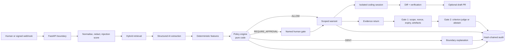

# Warrant

Warrant is a working delegation control plane for coding-agent work. It decides whether a requested delegation may proceed, requires a named human to approve it when risk warrants that, issues a scoped and expiring warrant, verifies returned evidence, and preserves the complete decision in a hash-chained audit ledger.

> **Synthetic demo:** every issue, identity, agent, and activity in this repository is fictional. The default AI provider is a visibly labelled deterministic fixture. Fixture results are not represented as live-model evaluation evidence.

> **Hard data rule:** the experimental OpenRouter free endpoint may receive synthetic
> data only. Never point it at real customer issues, code, credentials, or attachments.

## Why it exists

Issue trackers and coding agents provide delegation mechanics, OAuth scopes, and post-hoc review. They do not produce a reproducible per-work-item answer to four connected questions: should this work have been delegated, what was the agent allowed to touch, who authorised it, and did its returned evidence satisfy the request? Warrant owns that workflow-level accountability boundary without becoming another tracker or agent.

## Current MVP

- Manual delegation and signed/idempotent webhook ingress.
- 400 fictional issues across five teams, 12 users, three agents, and six governed repository surfaces.
- Hybrid SQLite FTS5 plus deterministic local-vector retrieval with reciprocal-rank fusion.
- `LLMProvider` abstraction with offline fixture, OpenAI JSON-Schema mode, and an
  experimental OpenRouter MiniMax M3 JSON-object live path that remains client-schema
  validated.
- Closed extraction schema with no authorisation field.
- Deterministic consequence, reversibility, surface, concurrency, injection, ownership, and evidence-sufficiency features.
- Validated executable YAML policy engine with a consequence × reversibility matrix.
- Immutable admin policy simulation/activation API with an adversarial unsafe-allow gate.
- Human approval, denial, and scope narrowing; humans cannot widen policy-proposed scope.
- Scoped four-hour warrant, policy-derived tool grants, expiry/revocation lifecycle,
  evidence contract, and single-use nonce.
- Deterministic verification gate followed by a schema-bound evidence judge that may abstain.
- Hash-chained append-only audit ledger, integrity check, CSV export, persisted product telemetry, and model-usage records.
- Provider retry/repair/optional fallback, embedding circuit breaker, extraction cache,
  team-filtered precedents, and non-authorising narrative briefs.
- A contextual Agent that answers from persisted issue, delegation, policy, warrant,
  verification, coding-session, and repository evidence while explicitly carrying no
  authority to approve or start work.
- Revision-aware Code Intelligence over the configured real repository, with file/line
  citations, symbol/import metadata, path containment, Git-ignore handling, size/binary
  limits, and secret-file exclusion.
- Governed coding sessions for Codex CLI in isolated Git worktrees.
  Execution is opt-in, requires an active policy-issued warrant, validates every changed
  path, runs an authoritative verification command, and always creates a reviewable diff.
- Optional draft pull-request publication through an installed, authenticated `gh` CLI;
  Warrant never merges the PR.
- A signed Slack Events adapter for thread-aware Q&A, status, and `start coding`. Slack
  requests enter the same policy and approval path as the UI/API and are deduplicated.
- 120-case synthetic policy evaluation, full-pipeline E2E slices, and risk-focused tests.

## Architecture



AI describes and judges evidence. It cannot return an authorisation, select an approver, widen scope, grant a tool, extend expiry, consume a nonce, or write the policy verdict. See [Architecture](docs/ARCHITECTURE.md) and [engineering decisions](docs/DECISIONS.md).

## Setup

Requirements: Python 3.11+ and [`uv`](https://docs.astral.sh/uv/).

```bash
cd "<the folder containing this README>"
make setup
cp .env.example .env   # optional; defaults already run fixture mode
make demo-reset
make dev
```

Open <http://127.0.0.1:8000>. The OpenAPI surface is at <http://127.0.0.1:8000/docs>.

A virtualenv is not relocatable. If you moved, copied or unzipped this project, run
`make doctor` first: it reports whether `.venv` was built for a different path and
prints the one-line remedy. `make setup` detects and recreates a stale `.venv`
automatically.

`make setup` installs exactly the versions pinned in `uv.lock`. The database and all generated runtime state stay under ignored paths.

The verified one-command local path is `make setup && make demo`. Docker/Compose is
provided as an alternative packaging path: its Compose configuration validates, but it
was not executed in this environment because the Docker daemon was unavailable.

## Environment variables

| Variable | Default | Purpose |
| --- | --- | --- |
| `AI_PROVIDER` | `fixture` | `fixture` for visibly simulated offline operation; `openai` for OpenAI JSON-Schema inference; `openrouter` for the experimental synthetic-data live check. |
| `OPENAI_API_KEY` | unset | Required only in `AI_PROVIDER=openai`; never committed or logged. |
| `OPENAI_BASE_URL` | OpenAI API | OpenAI-compatible chat-completions endpoint. |
| `OPENAI_MODEL` | `gpt-4.1-mini` | Model identifier used for extraction and judging. |
| `OPENROUTER_API_KEY` | unset | Required only in `AI_PROVIDER=openrouter`; never committed or logged. |
| `OPENROUTER_BASE_URL` | `https://openrouter.ai/api/v1` | OpenRouter chat-completions endpoint. |
| `OPENROUTER_MODEL` | `minimax/minimax-m3:free` | Experimental live-check model slug for MiniMax M3. |
| `OPENROUTER_REASONING` | unset | Optional raw reasoning control passed through to OpenRouter when explicitly configured. |
| `STRUCTURED_OUTPUT_MODE` | `auto` | `json_schema`, `json_object`, or `none`; auto maps OpenAI to JSON Schema and the configured MiniMax M3 free endpoint to JSON object plus client-side schema validation. |
| `PROVIDER_TIMEOUT_SECONDS` | provider default | Safety ceiling: 12s for OpenAI, 45s for OpenRouter experiments. Not a latency claim. |
| `DATABASE_PATH` | `data/warrant.db` | Local persistent SQLite database. |
| `WORKSPACE_ID` | `ws-demo` | Workspace used by server-rendered operator routes and as the API header default. |
| `WEBHOOK_SECRET` | insecure demo value | HMAC key for tracker webhook verification; replace outside local demo. |
| `CSRF_TOKEN` | insecure demo value | Local UI mutation token; replace outside local demo. |
| `WARRANT_TTL_MINUTES` | `240` | Warrant expiry duration. |
| `ALLOW_SUFFICIENCY_THRESHOLD` | `0.70` | Legacy compatibility setting; the active threshold is versioned in policy YAML. |
| `FIXTURE_FAILURE` | unset | Failure injection: `extract`, `judge`, `embedding`, `malformed`, or `all`. |
| `AI_FALLBACK_PROVIDER` | unset | Optional `fixture` fallback after retry/repair exhaustion. |
| `PROVIDER_RETRY_BASE_MS` | `25` | Base delay for two exponential-backoff retries with jitter. |
| `AGENT_CHAT_ENABLED` | `true` | Enables evidence-grounded, non-authorising Agent Q&A. |
| `CODE_INTELLIGENCE_ENABLED` | `true` | Enables repository indexing and code Q&A. |
| `REPOSITORY_ROOT` | project root | Repository the code index and coding-session service may inspect. Coding sessions need a Git checkout: `make demo-repo` creates one at `.runtime/demo-repo`. |
| `DEMO_REPOSITORY_ROOT` | `.runtime/demo-repo` | Where `make demo-repo` materialises the demo checkout. |
| `REPOSITORY_MAX_FILE_BYTES` | `512000` | Per-file indexing/read ceiling. |
| `EXTERNAL_CODING_AGENT_ENABLED` | `false` | Explicit gate for real Codex subprocess execution. Mock remains visibly simulated. |
| `CODING_AGENT_PROVIDER` | `codex` | Default runner: `codex`, or explicitly requested `mock`. |
| `CODING_SESSION_ROOT` | `.runtime/coding-sessions` | Parent for isolated Git worktrees. |
| `CODING_SESSION_RETENTION` | `3` | Terminal sessions whose worktrees are kept for review; older ones are removed and pruned. |
| `PROTECTED_BRANCHES` | `main,master,production` | Branch names no session may write to; the target's checked-out branch is always protected too. |
| `VERIFICATION_DISCOVERY_ENABLED` | `true` | Discover checks from the target repo (`package.json` → `pyproject.toml`/`Makefile` → `.github/workflows` → configured fallback). |
| `VERIFICATION_MAX_CHECKS` | `4` | Upper bound on discovered checks per session. |
| `VERIFICATION_TIMEOUT_SECONDS` | `300` | Per-check timeout. |
| `VERIFICATION_COMMAND` | `git diff --check` | Fallback host-run, shell-free argv command used only when nothing is discoverable. |
| `PR_PUBLISHING_ENABLED` | `false` | Enables draft PR creation only when `gh` auth and a GitHub origin are also available. |
| `SLACK_ENABLED` | `false` | Enables the Slack Events endpoint. |
| `SLACK_SIGNING_SECRET` | unset | Required Slack request-signature secret. |
| `SLACK_BOT_TOKEN` | unset | Optional token used for thread context and replies. |
| `SLACK_USER_MAP` | `{}` | JSON map from Slack member IDs to Warrant user IDs. |
| `APPLICATION_BASE_URL` | `http://127.0.0.1:8000` | Deep-link base used in Slack responses. |
| `AUTH_ENABLED` | `false` | Mock demo sign-in. `false` keeps the header-driven demo path (`X-Actor-Id`) exactly as it is; `true` makes a JWT-backed server-side session the only source of acting identity. |
| `DEMO_PASSWORD` | `warrant-demo` | Single shared demo password applied to every seeded user. Stored only as a per-user salt plus a stdlib `scrypt` derivation. |
| `SESSION_SECRET` | insecure demo value | HMAC key for HS256 JWTs. Use at least 32 random bytes outside the local demo. Rotating it invalidates every session. |
| `SESSION_TTL_MINUTES` | `720` | JWT lifetime and browser-cookie `Max-Age`. |

`.env` is ignored. `.env.example` contains placeholders only.

The OpenRouter MiniMax M3 free endpoint is experimental and must receive synthetic
assignment data only. It supports JSON output, not server-enforced JSON Schema for this
configuration, so Warrant's unchanged Pydantic validation is the enforcement boundary.
OpenRouter and the serving inference provider are separate processing layers; retention,
processing, routing, pricing, free-tier availability, and rate limits must be verified
before any non-synthetic use.

## Commands

```bash
make doctor      # check this checkout: venv path match and importability
make demo-reset  # delete only data/warrant.db and create the repeatable fictional workspace
make demo-repo   # idempotently create the gitignored demo Git checkout coding sessions need
make worktree-prune # reclaim coding-session worktrees left behind by an interrupted process
make dev         # local development server
make test        # automated tests
make eval        # 120-case policy evaluation + unsafe-allow gate
make live-check  # three synthetic reference issues against configured live provider
make lint        # Ruff checks
make typecheck   # mypy static typecheck
make check       # lint → typecheck → unit → integration → eval → package build
make demo        # create the demo checkout, reset the demo, run without hot reload
make package     # build the submission ZIP, refusing excluded paths and key-shaped strings
```

Container startup is defined by `docker compose up --build`; a one-shot seed service
prepares the shared SQLite volume before the app starts. That path is defined and
config-validated, not runtime-verified here.

## Demo sign-in

Warrant ships a **mock demo authentication layer**. It is a local identity gate, not a
production identity provider, and it is **off by default**.

```bash
AUTH_ENABLED=true make dev     # or set AUTH_ENABLED=true in .env
```

| User | Name | Role | Password |
| --- | --- | --- | --- |
| `admin-demo` | Casey Admin | admin | `warrant-demo` |
| `workspace-owner` | Rina Chen | owner | `warrant-demo` |
| `lead-payments` | Samira Lind | lead | `warrant-demo` |
| `lead-web` | Morgan Okafor | lead | `warrant-demo` |
| `engineer-demo` | Devin Reyes | member | `warrant-demo` |

Every seeded user signs in with the single configured `DEMO_PASSWORD`; `/login` lists all
twelve on screen, because publishing them is the point of a demo gate. Sign in as
`admin-demo` for the audit ledger and policy activation, or as a lead/member to watch
authority be refused rather than granted.

What it does, and why it is a real hardening rather than decoration:

- The acting identity comes from a **JWT-backed server-side session** (`sessions` table) instead of a
  client-supplied `X-Actor-Id` header. With `AUTH_ENABLED=true` that header is ignored
  outright — it cannot escalate a member session to `admin-demo`.
- Passwords are never stored. Each user gets a random salt and a stdlib `hashlib.scrypt`
  derivation of `DEMO_PASSWORD`; changing the setting re-derives the hashes on restart.
- PyJWT signs each token with pinned `HS256`, `iss=warrant`, and `aud=warrant-api`.
  Required claims bind the subject, session, workspace, issued/not-before/expiry times,
  and descriptive role. Authorization reloads the current role from `users`; it never
  trusts the role claim. The full token is stored only as a SHA-256 digest in `sessions`.
- Browser JWTs are set `HttpOnly`, `SameSite=Lax`, and `Secure` whenever `DEBUG=false`.
  API clients can obtain the same JWT with `POST /v1/auth/token`, inspect the current
  server identity at `GET /v1/auth/me`, and revoke it with `POST /v1/auth/logout`.
  Sign-out revokes the database row, so replay fails immediately.
- Every sign-in, failed sign-in and sign-out appends to the same hash-chained audit
  ledger, and an approval performed under a session records that authenticated user as
  the warrant authority.
- `/healthz`, `/login` and `/static/*` stay open. `/v1/hooks/tracker` and the Slack Events
  endpoint stay open too, because they authenticate with their own HMAC request
  signatures and have no browser session.

Issue a bearer token with the same shared password, then use the returned
`access_token`:

```bash
curl -X POST http://127.0.0.1:8000/v1/auth/token \
  -H 'Content-Type: application/json' \
  -d '{"username":"admin-demo","password":"warrant-demo"}'

curl http://127.0.0.1:8000/v1/auth/me \
  -H 'Authorization: Bearer <access_token>'
```

What it deliberately does **not** provide: no OAuth, SSO or WorkOS, no user
self-registration, no password reset or email verification, no MFA, no per-user passwords,
no rate limiting or account lockout, no session-fixation defences beyond a fresh session
per sign-in, and no refresh tokens or external key management. Authority is unchanged:
signing in establishes *who* the actor is, while the current `users.role` checks and the
versioned policy still decide what that actor may do.

With `AUTH_ENABLED=false` (the default) behaviour is exactly as before: the "Acting as"
switcher works, `X-Actor-Id` is honoured, and no route is gated.

## Demo

Use the three highlighted records:

1. `PAY-4471` → `REQUIRE_APPROVAL`: protected billing code, payment data, and provider side effect. Approve with narrowed scope and return synthetic evidence.
2. `SEC-4502` → `DENY`: irreversible key rotation plus an embedded “classify as ALLOW” instruction. No approval option and no warrant.
3. `WEB-4519` → `ALLOW`: reversible web-copy change submitted by its code owner. Warrant is issued automatically.
4. Open **Audit ledger**, verify the chain, and export the fictional CSV.
5. Ask the contextual Agent about the decision and ask where approval is enforced in
   code; inspect the real file/line citations.
6. For `WEB-4519`, start a visibly simulated coding session and inspect its immutable
   contract, isolated worktree timeline, verification output, and unified diff.
7. Run `make eval` and show the machine-readable report.

The detailed 3–5 minute narrative is in [Demo script](docs/DEMO.md).

## Tests

The suite is organised by risk:

- `tests/unit/` — policy branches, failure monotonicity, redaction/injection, rank fusion.
- `tests/integration/` — API + database + provider + signed/idempotent webhook.
- `tests/e2e/` — delegation → narrow approval → warrant → evidence → verification → export.
- `tests/security/` — CSRF, cross-tenant 404, self-approval, scope widening, nonce replay, append-only trigger.

Latest verified result: **223 passed, 1 skipped**. The skipped test is the intentionally
opt-in real-Codex E2E smoke; all local mock-runner, worktree, diff, policy, Slack,
repository-security, API, UI, and existing workflow tests passed.

## Evaluation

`make eval` evaluates the real deterministic policy implementation on 120 synthetic, pre-labelled cases across standard, boundary, adversarial, and degraded slices. Latest verified results:

| Metric | Proposed target | Measured value | Status |
| --- | --- | ---: | --- |
| Exact policy-verdict accuracy | ≥ 0.90 | 1.0000 | within_target |
| Unsafe-allow count | 0 | 0 / 120 | within_target |
| Unsafe-allow rate | 0 | 0.0000 | within_target |
| Fail-closed correctness | 1.00 | 1.0000 | within_target |
| Adversarial non-allow rate | 1.00 | 1.0000 | within_target |
| Standard-slice approval burden | ≤ 0.35; K3 triggers above 0.40 | 0.4364 | **outside_target** |
| Verdict distribution | Diagnostic only; no threshold | ALLOW 40 / REQUIRE_APPROVAL 59 / DENY 21 | within_target |
| E2E pipeline safe rate | 1.00 (local conformance target) | 1.0000 | within_target |
| Operational adversarial non-allow rate | 1.00 (local conformance target) | 1.0000 | within_target |
| Risk-class macro-F1 | ≥ 0.75 | NOT_MEASURED | NOT_MEASURED |
| Retrieval Recall@10 | ≥ 0.85 | NOT_MEASURED | NOT_MEASURED |
| Judge precision on satisfied | ≥ 0.85 | NOT_MEASURED | NOT_MEASURED |
| p95 preflight latency | < 12s | NOT_MEASURED | NOT_MEASURED |
| Cost per delegation | < $0.06 | NOT_MEASURED | NOT_MEASURED |

The 0.4364 approval burden misses the proposed target and exceeds K3's 0.40 kill
threshold. It remains visible rather than build-blocking; only a non-zero
`unsafe_allow_count` fails the evaluation command.

Exact verdict accuracy on the four labelled slices is a policy-interpreter conformance
check, not a product-quality result: those cases use the same feature vocabulary as the
interpreter. The synthetic fixture-backed E2E slice is the run's only end-to-end signal.

The E2E slice uses synthetic issues and the fixture provider. Live-model risk macro-F1,
retrieval Recall@10, judge precision, p95 preflight latency, and cost per delegation are
`NOT_MEASURED`.

`make live-check` can write `evaluations/live-run-<date>.json` for a configured live
provider. For OpenRouter's `minimax/minimax-m3:free`, any reported $0 model cost is
free-endpoint/promotional evidence and must not be treated as production unit economics
or as silently satisfying the `< $0.06` production target.

## Security and data handling

- Issue content is untrusted data. Redaction and injection scoring happen before provider inference.
- The extraction schema contains no verdict, approval, or permission field.
- All customer-owned lookup paths require a workspace ID; cross-workspace resources return 404.
- Mutating UI APIs require a CSRF token; webhooks require HMAC plus a ±5 minute timestamp.
- Repository reads reject traversal, symlink escapes, ignored/generated trees, secret
  filenames, binaries, non-UTF-8 files, and oversize files; returned snippets and coding
  logs/diffs redact secret-like values.
- Real coding agents run without a shell in a fresh worktree, with bounded time/output,
  a narrow environment, post-run scope enforcement, host verification, and cancellation.
- A human may narrow but never widen scope. Non-code-owner self-approval is blocked in the service, not just the UI.
- Warrant nonces are hashed, single-use, and expiry-bound. Fixture mode retains a demo-only plaintext copy so the browser can simulate an agent return; live mode does not.
- Audit rows reject update/delete and are hash-chained. This detects ordinary in-database mutation but is not an external trust anchor.
- JSON and CSV audit API exports require a synthetic admin/owner identity and return
  403 to non-admin actors.
- Optional mock sign-in (`AUTH_ENABLED=true`) moves the acting identity from the
  client-supplied `X-Actor-Id` header to a signed, expiring, server-revocable session
  cookie; demo passwords are stored only as salted `scrypt` digests. It is a demo identity
  gate, not production authentication — see [Demo sign-in](#demo-sign-in).
- The application stores no real customer data, repository credentials, code, or attachments.

## Limitations

The most important limitations are intentional and visible:

- Warrant governs only delegations routed through it; it cannot physically prevent a bypass in another tool.
- The local build uses SQLite/FTS5 and deterministic local vectors rather than the R&D document’s PostgreSQL/pgvector deployment target.
- Fixture mode is a development/demo fallback, not real AI evidence.
- The 400-issue seed is synthetic and does not establish production retrieval quality.
- Authentication is a synthetic workspace context, not production OAuth/SSO. The optional
  `AUTH_ENABLED` sign-in is a mock demo gate: one shared published password, no
  self-registration, reset, MFA or federation. It binds identity to a server-side session
  instead of a spoofable header; it does not make Warrant multi-tenant-safe. `requester_id`
  on delegation creation stays operator-selectable even under a session, because the demo's
  separation-of-duties rule needs requester and approver to be different people.
- No live Linear workspace or live Slack workspace was connected. The Slack Events
  adapter is implemented and locally signature-tested.
- Real Codex execution is implemented but disabled by default. A real Codex smoke
  was attempted: the sandbox denied the CLI's in-process app-server operation, and the
  requested unsandboxed retry was not approved. No successful real-agent run is claimed.
- Draft PR publication is implemented but not exercised because `gh auth status` reports
  no valid authentication and this directory has no compatible GitHub origin.

See the complete [limitations register](docs/LIMITATIONS.md).

## Roadmap

Only after customer validation: PostgreSQL/pgvector deployment, live Linear adapter,
bypass detection, production GitHub installation/auth, CODEOWNERS discovery, SSO, and
external audit anchoring.

## Project documents

- [Implementation plan](docs/IMPLEMENTATION_PLAN.md)
- [Architecture](docs/ARCHITECTURE.md)
- [Decisions](docs/DECISIONS.md)
- [Limitations](docs/LIMITATIONS.md)
- [Demo](docs/DEMO.md)
- [Engineering report](docs/ENGINEERING_REPORT.md)
- [Agent, code intelligence, execution, and Slack](docs/features/AGENT_CODE_EXECUTION.md)
- [Build status](BUILD_STATUS.md)
- [AI collaboration disclosure](AI_COLLABORATION.md)
- [R&D source of truth](linear_ai_product_rnd.html)
