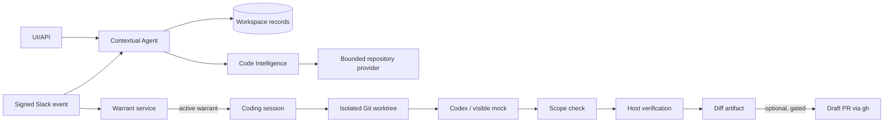
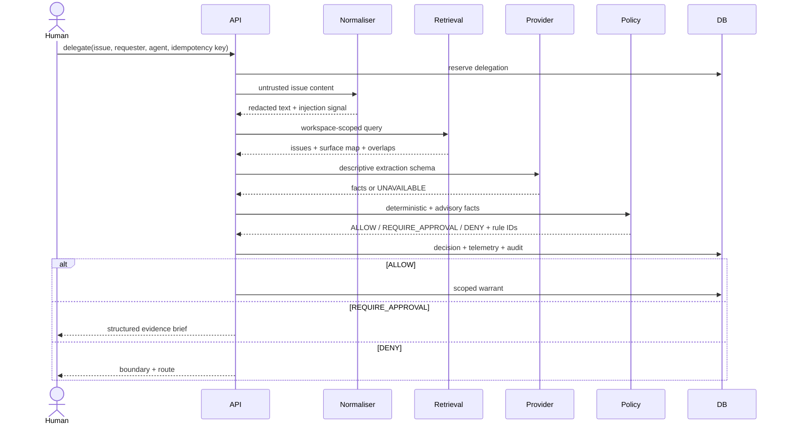
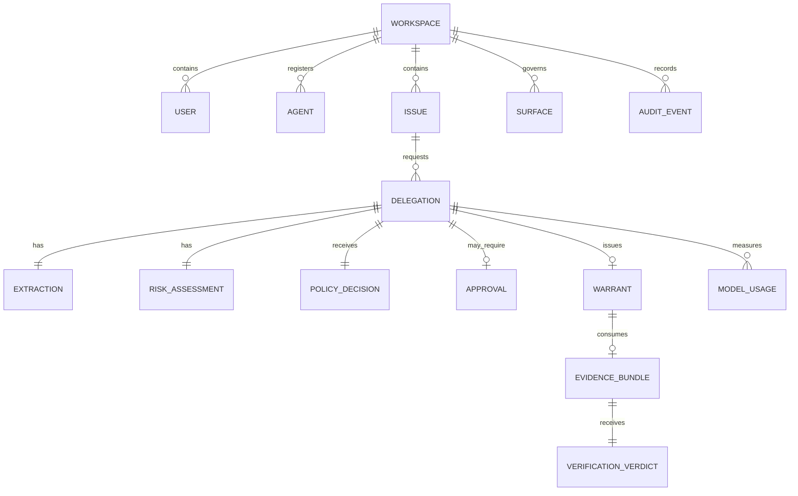

# Architecture

## Components

Warrant is a modular monolith with five integrity boundaries:

1. **HTTP/UI boundary:** FastAPI validates closed Pydantic request schemas, applies workspace scope, verifies webhook HMAC/timestamps, and requires CSRF for browser mutations.
2. **Untrusted-content boundary:** issue and evidence text are data. Normalisation, redaction, and injection scoring run before any provider call.
3. **Provider boundary:** `LLMProvider` exposes descriptive `extract`, evidentiary
   `judge`, and non-authorising `brief` operations. Their closed schemas cannot carry
   permission.
4. **Policy boundary:** `evaluate_policy()` is a pure function over validated risk features and versioned policy text. It has no database, network, or model access.
5. **Record boundary:** important events append to a mutation-blocked, SHA-256-linked ledger. A write failure aborts the operation rather than allowing an unrecorded decision.

The new collaboration surfaces reuse those boundaries rather than creating a second
authority path. `AgentService` assembles grounded records and Code Intelligence results,
but every response is marked advisory and non-authorising. `SlackAdapter` verifies and
deduplicates events, then calls the same Agent and Warrant services. `CodingSessionService`
will only accept an active warrant containing `write_files` and `run_tests`.

## Repository and execution boundary

The local repository provider canonicalises every path and excludes ignored/generated
directories, secrets, binaries, invalid UTF-8, oversize content, absolute paths,
traversal, and escaping symlinks. The code index is cached by repository revision and
stores metadata rather than repository contents.

Each coding session snapshots the issue, policy decision, approval, warrant, base Git
revision, path/tool scope, requested outcome, and verification command. The runner is a
shell-free subprocess with a narrow environment, timeout, process-group cancellation,
and bounded/redacted output. A clean detached worktree and unique `agent/*` branch keep
the source checkout unchanged. Warrant scope is enforced again against the generated
diff before host verification. A diff is mandatory even when PR publishing is disabled.

Draft PR creation is deliberately later: only a completed session with a permitted
`open_draft_pr` tool can be committed and pushed, and only after `gh` availability/auth
and GitHub-origin checks. There is no merge operation.

## Slack boundary

Slack uses the raw-body `v0` HMAC and rejects timestamps outside five minutes. `event_id`
is a durable idempotency key; bot and unsupported events are ignored. At most ten thread
messages are fetched, prompt input is bounded, and Slack member IDs must map to known
Warrant identities for new delegations. `start coding` first creates/reuses a delegation,
then honors deterministic deny/approval states, and starts no subprocess without a warrant.

## Request flow

## AI flow

`FixtureProvider` is deterministic and clearly labelled simulated.
`OpenAICompatibleProvider` performs genuine JSON-Schema constrained inference through an
OpenAI-compatible chat-completions API. `OpenRouterProvider` is a first-class
OpenAI-compatible transport for synthetic live checks; the configured
`minimax/minimax-m3:free` capability uses `response_format: {"type": "json_object"}`,
inlines the schema in the prompt, tolerantly strips wrappers, then enforces the same
Pydantic schemas client-side. Parsed JSON that fails validation is malformed output, not
partial evidence. Providers return `ProviderResponse` with provider/model/latency,
structured-output mode, schema repair count, token usage, reported cost, and serving
provider when exposed. Missing token counts, costs, and serving-provider metadata remain
null; the system never fabricates them.

Extraction fields are reproduction presence, criteria, affected surfaces, data classes, external side effects, missing information, scope estimate, injection detection, and confidence. No authorisation field exists. Provider failure or malformed output sets extraction unavailable, reduces evidence sufficiency, and reaches rule `R-020` (`REQUIRE_APPROVAL`).

Verification is two gates. Gate 1 deterministically verifies nonce, expiry, scope, artefacts, and test output. Gate 2 asks the provider to classify each criterion as satisfied, not satisfied, or inconclusive with a citation. Provider failure produces `INCONCLUSIVE`, never `PASS`.

## Policy engine

Validated YAML is the executable source of truth. Its complete consequence ×
reversibility matrix establishes a base decision; ordered rules can reduce autonomy,
terminal matches stop evaluation, and fail-closed matches label degraded paths. Invalid
or version-mismatched YAML produces `REQUIRE_APPROVAL / POLICY_UNAVAILABLE`. Tool grants
and the never-grantable list come from the same document.

Admins can simulate and activate immutable policy versions through the API. Activation
returns 409 if a candidate newly permits any case in the adversarial evaluation slice.
Simulation also applies that guard and returns last-N persisted delegation diffs with
newly allowed cases first. Every decision persists the exact policy version and SHA.

## Persistence and retrieval

SQLite is the local implementation. Core state is durable, migrations are idempotent SQL,
issue search uses FTS5/BM25, and the audit table has database triggers rejecting updates
and deletes. The semantic channel uses stable hashed token vectors, cosine similarity,
and reciprocal-rank fusion. Workspace and team filtering happen before ranking; prior
deterministic decisions appear as precedents. Extraction caches by issue ID, revision,
and complete prompt hash.

The R&D target remains PostgreSQL 16 with pgvector. The migration seam is the small `Database` repository; the domain, policy, schemas, API, and evaluation code do not depend on SQLite types. PostgreSQL is the revisit trigger when a live tracker adapter, concurrent workers, >10k issues, RLS, or measured retrieval-quality work begins.

## Data model

## Security boundary

The trusted core is request validation, workspace resolution, redaction, deterministic features, policy, warrant construction, nonce/expiry, verification gate 1, and audit. Issue content, retrieved text, and agent evidence are untrusted. Registered users/agents and signed webhooks are authenticated or semi-trusted identities whose intent is not assumed. External providers see only normalised/redacted text.

## Observability

Product events are persisted for delegation receipt, policy decision, warrant issuance,
evidence verification, and schema repair. `/metrics` emits counters derived from those
records and verdict distribution. `model_usage` records provider, model, operation,
nullable token/cost values, provider-reported cost, reasoning/total tokens,
serving-provider metadata when exposed, latency, success, schema repair count, and error
class. Audit events store decisions and references rather than raw prompts. Full
OpenTelemetry tracing from the R&D design is not implemented and is recorded as a
limitation.

## Deployment

`make setup && make demo` is the reproducible local deployment. `Dockerfile` and
`docker-compose.yml` define a seed-then-app SQLite container path. CI runs lint → typecheck →
unit → integration → evaluation/unsafe-allow gate → package/container build. The current
deployment has no Redis, broker, or vector database. Hosted deployment is not claimed.

## Design decisions

The principal decisions and rejected alternatives are in [DECISIONS.md](DECISIONS.md). The defining decision is structural: AI may supply evidence but deterministic code alone supplies authority.
